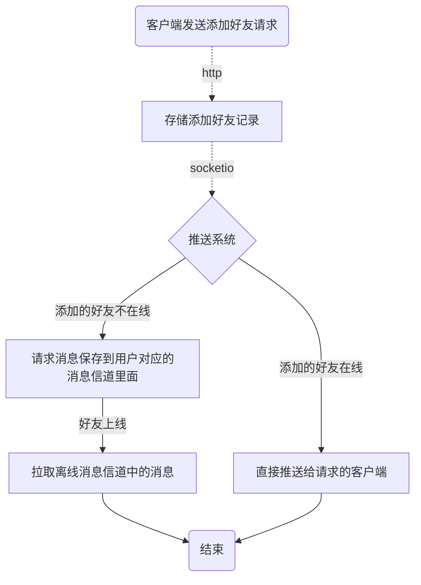
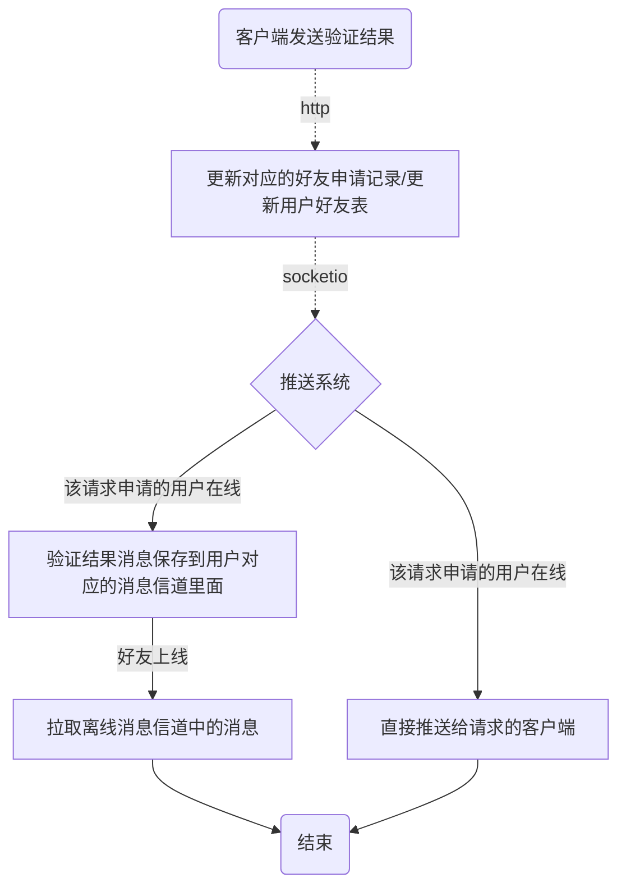

#### about
本模块关于http相关业务，基于fastapi，对用户可见,主要包括：  
- 维护用户数据：用户基本信息等；
- 维护好友关系：好友请求、好友列表、好友信息等；
- 维护群组信息：群创建、解散、成员管理等；
- 提供数据：离线拉取、历史记录同步；

#### 好友管理维护
##### 好友添加
- 1.申请方添通过HTTP发送到业务逻辑处理SERVER.       
- 2.业务逻辑处理SERVER通过socketio推送到推送系统(socket-io的添加好友接口).              
- 3.推送系统判断好友是否在线,是的话直接推送，不在线直接推送到redis用户的msg-channel里面             

##### 添加好友流程

##### 好友验证通过/拒绝
- 1.验证添通过`HTTP`发送到验证结果`(接受/拒绝)`业务逻辑处理SERVER.          
- 2.业务逻辑处理SERVER通过socketio推送到推送系统(socket-io的添加好友接口).          
- 3.推送系统判断好友是否在线,是的话直接推送，不在线直接推送到redis用户的msg-channel里面         

##### 好友验证通过/拒绝流程
